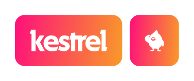

<picture>
  <source media="(prefers-color-scheme: dark)" srcset="ui/static/logo/imagotype-light.svg">
  
</picture>

[kestrel](https://github.com/CaptDany/kestrel) is a purchase planner that helps you calendarize e-commerce purchases based on your paydays and budget.

Paste a link from any supported store (Amazon, MercadoLibre, Aliexpress, IKEA, Walmart) and kestrel automatically extracts the price and schedules the purchase on an upcoming payday.

[](https://go.dev)
[](LICENSE)
[](https://hub.docker.com/r/capndany/kestrel)

Paste a link from any supported store — Amazon, MercadoLibre, Aliexpress, IKEA, Walmart — and kestrel automatically extracts the price, tracks drops, and schedules the purchase on your next payday.

## Features

- **Price Extraction** — Paste any product URL, kestrel auto-detects title, price, currency, and image
- **Payday Scheduling** — Monthly, biweekly, weekly, or custom — kestrel spreads purchases across upcoming paydays
- **Budget Modes** — Per-payday cap, flexible (base + one-off bonuses), or total pool
- **Spending Analytics** — Category donut chart, monthly/weekly bar graph, saving progress, variance vs actuals
- **Price Tracking** — Automatically re-scrapes prices and notifies you on drops
- **Notifications** — In-app alert panel for price drops and purchase-ready reminders
- **Wishlist Import** — Import entire Amazon wishlists with one click
- **Playwright Support** — Optional browser-based scraper for JavaScript-heavy sites
- **PWA** — Installable on mobile, works offline, dark theme throughout
- **Self-Hosted** — Single Go binary, SQLite-backed, zero external dependencies

## Quick Start

### Docker (recommended)

```bash
docker compose up -d
```

Open http://localhost:8000

### Binary

Download the latest release for your platform, then:

```bash
./kestrel
```

The database is created automatically at `data/kestrel.db`.

## Configuration

| Variable | Default | Description |
|----------|---------|-------------|
| `KESTREL_PORT` | `8000` | HTTP listen port |
| `KESTREL_DB_PATH` | `data/kestrel.db` | SQLite database path |
| `KESTREL_EXTERNAL_URL` | — | Public URL for external access |

## Architecture

```
┌─────────────┐     ┌──────────────┐     ┌───────────┐
│  htmx +     │────▶│   Go server  │────▶│  SQLite   │
│  Alpine.js  │◀────│  (chi router)│◀────│ (embedded)│
│  Tailwind   │     │              │     │           │
└─────────────┘     ├──────────────┤     └───────────┘
                    │  Extractor   │
                    │  (HTTP/goquery│
                    │   or sidecar) │
                    ├──────────────┤
                    │  Price       │
                    │  Tracker     │
                    ├──────────────┤
                    │  Notifier    │
                    │  (in-app,    │
                    │   SMTP stub) │
                    └──────────────┘
```

- **Frontend**: Server-rendered Go templates with htmx for dynamic updates, Alpine.js for interactivity, Tailwind CDN for styling
- **Backend**: Single Go binary with chi router, embedded SQLite via modernc.org/sqlite
- **Extraction**: Built-in HTTP parsing via goquery; optional Playwright sidecar container for JS-rendered sites
- **Persistence**: No external DB server — SQLite file stored in the data directory

## Development

```bash
git clone https://github.com/CaptDany/kestrel
cd kestrel
go run .
```

## TrueNAS App

kestrel is available as a community app in the TrueNAS catalog.  
See the [truenas](truenas/) directory for manifests, or contribute to the upstream PR.

## Supported Stores

- Amazon (all country TLDs)
- MercadoLibre / MercadoLivre
- Aliexpress
- IKEA
- Walmart

## License

GNU General Public License v3.0 — see [LICENSE](LICENSE).
